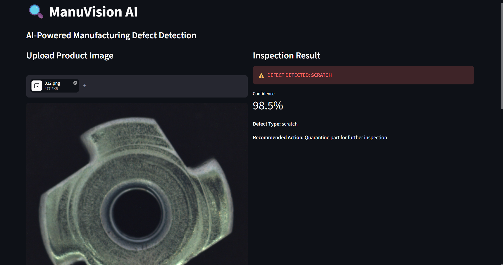
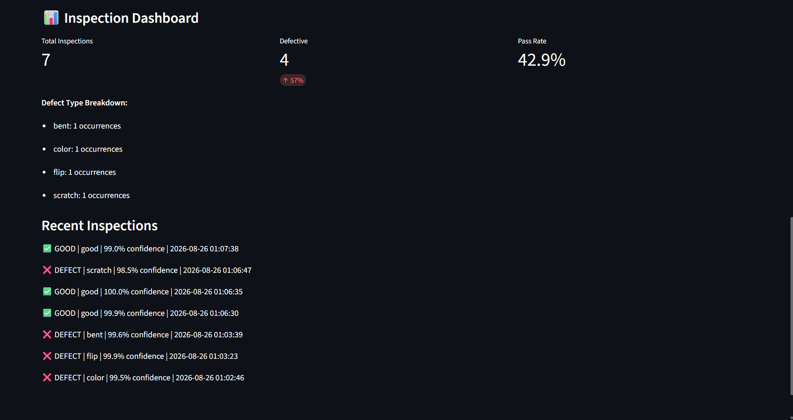
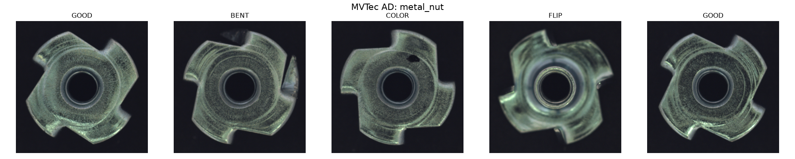
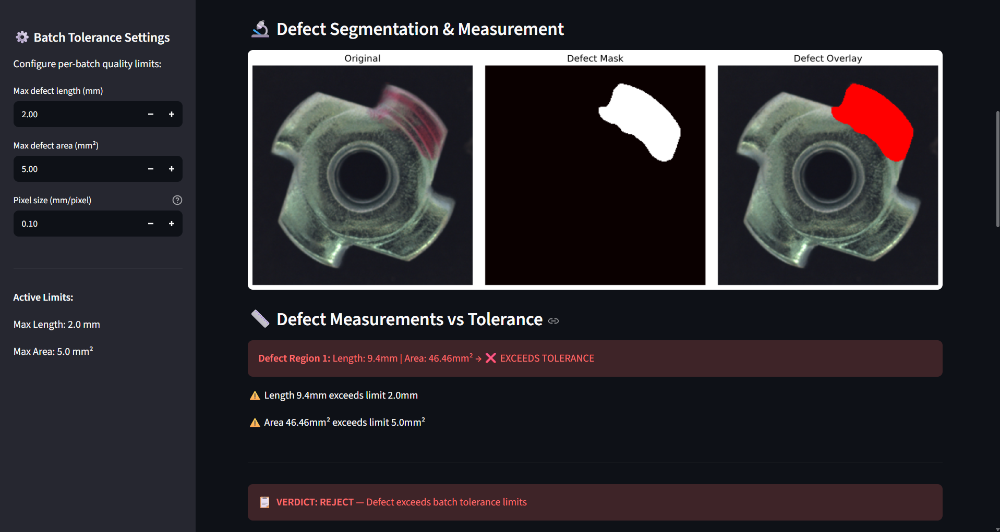
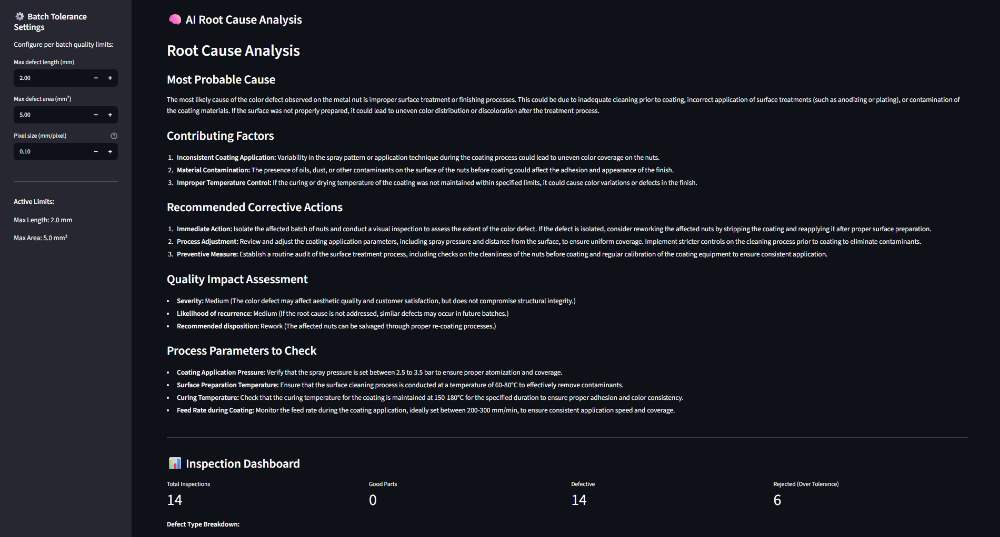
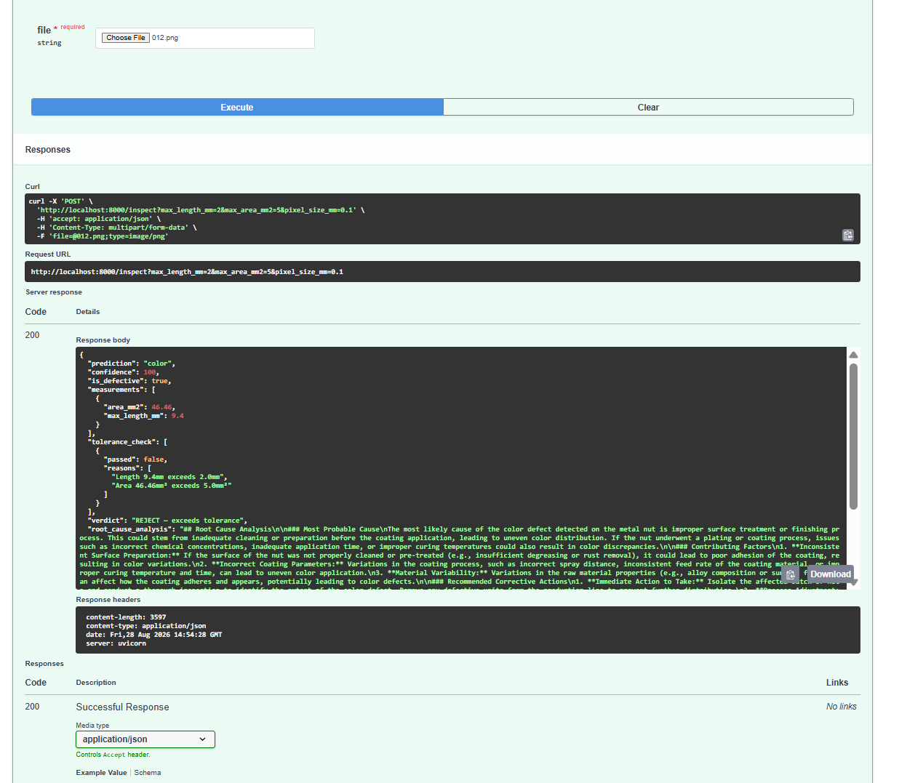

# 🔍 ManuVision AI - AI Manufacturing Quality Inspector

An AI-powered manufacturing defect detection system that identifies product defects using computer vision and logs inspection results with an analytics dashboard.

Trained on the MVTec Anomaly Detection dataset. Built with PyTorch, Streamlit, and SQLite.

## What It Does

1. **Upload** a product image from the production line
2. **AI detects** whether the part is good or defective — classifies defect type (bent, scratch, color, flip) with confidence scores
3. **Logs** every inspection to a SQL database automatically
4. **Dashboard** shows total inspections, defect rate, defect type breakdown, and recent inspection history

## Demo





## Results

- **Model:** ResNet18 (pretrained on ImageNet, fine-tuned on MVTec AD)
- **Dataset:** MVTec Anomaly Detection — metal_nut category
- **Validation Accuracy:** 89%
- **Defect Types Detected:** bent, color, flip, scratch
- **Inference:** Real-time, <100ms per image on CPU

## Tech Stack

- **Detection Model:** PyTorch, ResNet18, Transfer Learning
- **Dataset:** MVTec AD (industry-standard anomaly detection benchmark)
- **Database:** SQLite (inspection logging + analytics)
- **Frontend:** Streamlit (interactive dashboard)
- **Language:** Python 3.10+

## Architecture

```
Product Image → ResNet18 Classifier → Defect/Good + Confidence Score
                                    ↓
                              SQLite Database (log every inspection)
                                    ↓
                              Streamlit Dashboard (trends, defect rates)
```

## Quick Start

```bash
git clone https://github.com/VdKPr/ManuVision-AI.git
cd ManuVision-AI
pip install torch torchvision streamlit Pillow matplotlib scikit-learn
streamlit run app.py
```

## Project Structure

```
ManuVision-AI/
├── explore_mvtec.py        # Dataset exploration and visualization
├── train_detector.py       # Model training script
├── app.py                  # Streamlit app with dashboard
├── best_defect_model.pth   # Trained model weights
├── defect_logs.db          # SQLite inspection database
├── mvtec_samples.png       # Sample defect images
└── README.md               # This file
```
## Level 2: Defect Segmentation & Measurement

- **U-Net** trained on MVTec AD ground truth masks to segment exact defect regions
- Post-processing pipeline: binary opening/closing + min-size filtering (same approach as medical image segmentation)
- Automatic **defect measurement**: area (mm²) and length (mm) calculated from segmented regions
- **Configurable batch tolerances** — operators set max length/area limits per batch via sidebar
- Verdict: ACCEPT (within tolerance) or REJECT (exceeds limits)



## Level 3: LLM Root Cause Analysis

- **GPT-4o-mini** generates manufacturing-specific root cause analysis for each detected defect
- Analysis includes: probable cause, contributing factors, corrective actions, severity assessment, and specific process parameters to check
- Powered by **LangChain** prompt engineering with domain-specific manufacturing context
- Transforms ManuVision AI from a detection tool into a **diagnostic system**



## Updated Architecture

```
Product Image → ResNet18 Classifier → Defect Type + Confidence
                    ↓
              U-Net Segmentation → Defect Mask → Measurements (mm², mm)
                    ↓
              Tolerance Check → ACCEPT / REJECT
                    ↓
              GPT-4o-mini → Root Cause Analysis + Recommended Actions
                    ↓
              SQLite Database → Inspection Dashboard
```

## Level 4: FastAPI REST API

- Production-grade **REST API** with auto-generated Swagger documentation
- `POST /inspect` — upload image → returns full JSON: classification, measurements, tolerance, root cause
- `GET /dashboard` — inspection statistics, defect breakdown, recent history
- `GET /stats` — quick defect rate monitoring
- `GET /health` — API health check
- Any frontend, mobile app, or factory system can integrate via HTTP



## Roadmap

- [ ] LLM-powered root cause analysis — AI explains WHY the defect happened and recommends process fixes
- [ ] FastAPI backend for production deployment
- [ ] Docker containerization
- [ ] Multi-product support (currently metal_nut only)
- [ ] Real-time camera feed integration
- [ ] Deploy to cloud with public API

## Why This Project Matters

Manufacturing quality inspection is a $4.5B market. Human inspectors miss 20-30% of defects and fatigue within 2 hours. This system achieves 89% accuracy with zero fatigue, logging every decision for traceability — addressing real industry pain points in automated quality control.


