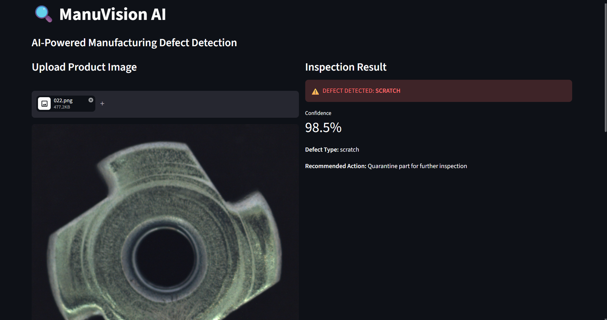
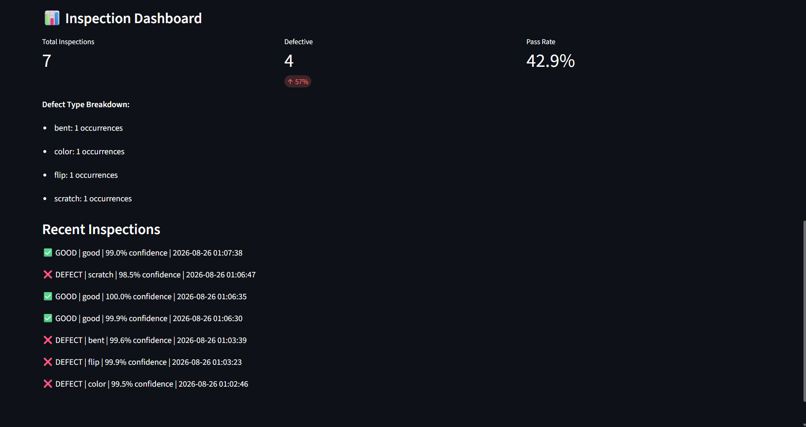
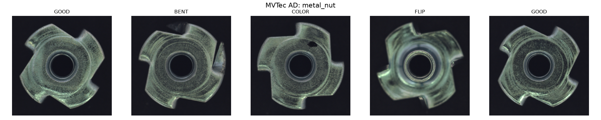
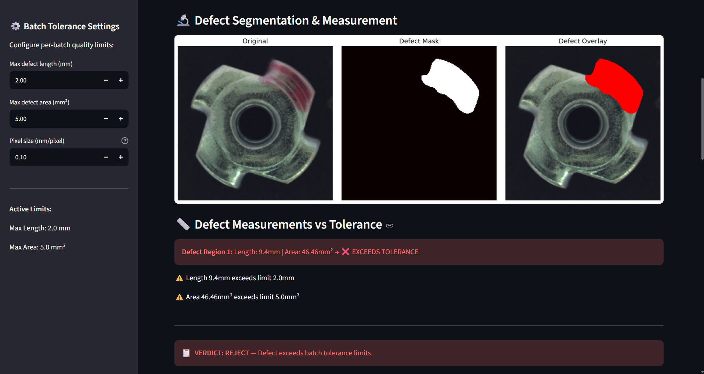
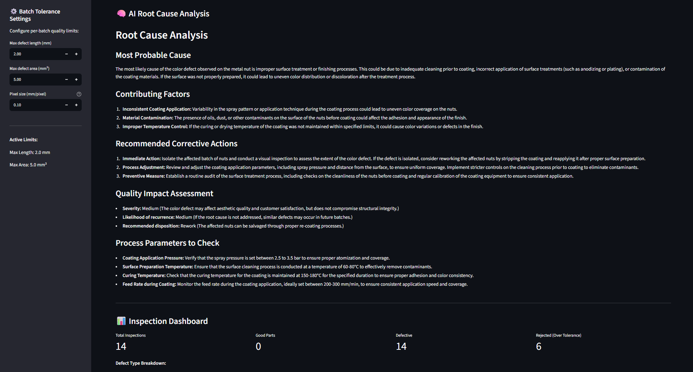
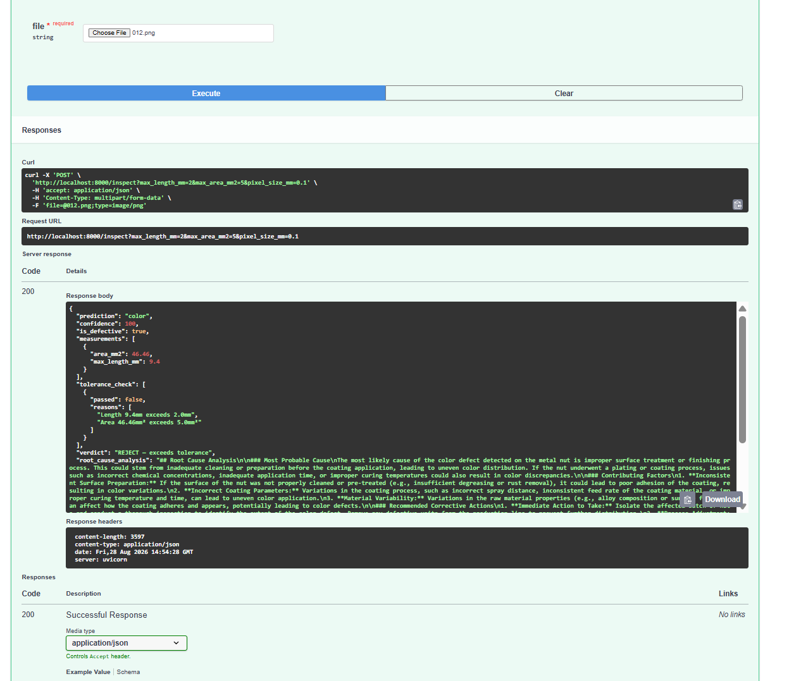

# 🔍 ManuVision AI - AI Manufacturing Quality Inspector

An AI visual-inspection pipeline for manufactured parts. It classifies the defect, segments and measures it, decides ACCEPT / REJECT / REVIEW against batch tolerances, drafts a root-cause note for the quality engineer, and logs every inspection.

Trained and evaluated on the MVTec AD dataset (metal_nut category). Built with PyTorch, Streamlit, FastAPI, LangGraph and SQLite.

## What It Does

1. **Upload** a product image.
2. **Classify**: a ResNet18 labels the part good, bent, color, flip or scratch, with a confidence score.
3. **Segment and measure**: for defective parts, a U-Net outlines the defect; area (mm²) and length (mm) use a pixel scale derived from the part itself.
4. **Decide**: measurements are checked against configurable batch tolerances. The verdict is ACCEPT, REJECT, or REVIEW when the classifier finds a defect but segmentation finds no region.
5. **Explain**: GPT-4o-mini drafts a probable root cause and corrective actions. This is advisory only; it never makes the decision.
6. **Log**: every inspection goes to SQLite, with a dashboard of defect rates and history.

## Demo





## Results (held-out and seeded — details in DEVLOG, Level 8)

- **Classifier** (ResNet18, MVTec AD metal_nut, 5 classes): 97.0% ± 3.3% test accuracy over six seeds with augmentation (95.0% on fresh seeds), macro F1 0.93, escaped defects 7% (8/111), false rejects 0/291. Without augmentation: 90.6% ± 5.2%, escapes 17%.
- **Segmentation** (U-Net): per-image Dice 0.833 and IoU 0.733 on 18 validation defect images; no false alarms on good parts after post-processing.
- **Measurement**: length median error 3%, area median error 14%; accept/reject agreement with ground truth 83–100%.
- **Latency** (RTX 4060): about 5 ms for good parts and about 23 ms for defective parts locally; the optional LLM root-cause step adds 8–11 s.
- **Scale**: 0.0283 mm per pixel, derived from an assumed 16 mm part width.

Every number comes from logs in [`results/`](results/). Test splits are small (67 images each), so treat the figures as ranges, not precise values.

## Tech Stack

- **Classification:** PyTorch, ResNet18 (ImageNet weights, fine-tuned), data augmentation
- **Segmentation:** U-Net trained from scratch, Dice + BCE loss, morphological post-processing
- **Root cause:** GPT-4o-mini via LangChain
- **Orchestration:** LangGraph, with a conditional edge so good parts skip segmentation
- **Serving:** FastAPI REST API, Streamlit UI, Docker image for the Streamlit app
- **Storage:** SQLite
- **Dataset:** MVTec AD (metal_nut)
- **Language:** Python 3.10+

## Architecture

```
Product Image → ResNet18 Classifier → Defect Type + Confidence
                    ↓   (good parts stop here)
              U-Net Segmentation → Defect Mask → Measurements (mm², mm)
                    ↓
              Tolerance Check → ACCEPT / REJECT / REVIEW
                    ↓
              GPT-4o-mini → Root Cause Analysis (advisory)
                    ↓
              SQLite Database → Inspection Dashboard
```

## Quick Start

```bash
git clone https://github.com/VdKPr/ManuVisionAI.git
cd ManuVisionAI
pip install -r requirements.txt
```

For the root-cause step only, create a `.env` file with `OPENAI_API_KEY=your-key`.

Model weights and the dataset are not stored in this repo. To reproduce them:

1. Download MVTec AD (see Dataset below) and set the dataset path at the top of each script to your `metal_nut` folder.
2. Train the classifier: in `ablation_study.py` set `CONFIGS = ["aug+mirror"]`, `SEEDS = [42]` and `SAVE_CKPTS = True`, run it, and copy the saved checkpoint to `best_metalnut_augmirror_seed42.pth`.
3. Train the U-Net with `python train_segmentation.py`. It writes `best_segmentation_model.pth`.
4. Derive the pixel scale with `python calibrate_scale.py`. It writes `calibration.json`.

Then run:

```bash
streamlit run app.py          # web UI at http://localhost:8501
uvicorn api:app --reload      # REST API, docs at http://127.0.0.1:8000/docs
python agent.py image.png     # LangGraph flow from the command line
```

## Project Structure

```
ManuVisionAI/
├── app.py                   # Streamlit app: inspect, measure, verdict, dashboard
├── api.py                   # FastAPI backend: /inspect, /dashboard, /stats, /health
├── agent.py                 # LangGraph flow, run from the command line
├── root_cause.py            # GPT-4o-mini root-cause prompt
├── measure_defect.py        # measurement and tolerance helpers
├── train_metalnut.py        # original classifier trainer
├── train_segmentation.py    # U-Net trainer
├── ablation_study.py        # seeded augmentation / weighted-CE ablation
├── calibrate_scale.py       # pixel-to-mm scale from part geometry
├── eval_segmentation.py     # Dice / IoU and post-processing ablation
├── measurement_eval.py      # measurement error and accept/reject agreement
├── timing_study.py          # per-stage latency
├── protocol_eval.py, lr_study.py, multiproduct_eval.py, binary_eval.py   # earlier audits
├── train_autoencoder.py, ae_by_type.py                                   # autoencoder experiment
├── results/                 # logs behind the numbers above
├── DEVLOG.md                # full development log, including corrections
└── Dockerfile               # containerised Streamlit app
```

## How It Was Built

- **Level 1, classification:** ResNet18 transfer learning on metal_nut, with SQLite logging and a Streamlit dashboard.
- **Level 2, segmentation and measurement:** a U-Net trained on MVTec ground-truth masks. Post-processing (binary opening, closing and a minimum-size filter) removes speckle false alarms on good parts. Area and length are converted to millimetres, and operators set per-batch tolerances in the sidebar.
- **Level 3, LLM root cause:** GPT-4o-mini generates a probable cause, corrective actions and a severity from the defect type and measurements. It is text-only and advisory; I rated it correct on 5 of 8 cases in a small self-review.
- **Level 4, REST API:** FastAPI with `/inspect`, `/dashboard`, `/stats` and `/health`, plus auto-generated Swagger docs.
- **Level 5, Docker:** a Dockerfile for the Streamlit app.
- **Level 6, LangGraph routing:** a state graph with one conditional edge, so good parts skip segmentation, measurement and root cause. That cuts local inspection time per good part by about 79%.
- **Level 7, experiments:** a 74-class multi-product model reached 90.4% accuracy (after fixing a label bug), and a binary good-vs-defect model 94.5%. An autoencoder anomaly detector caught only 29% of defects. All of these are documented in the DEVLOG.
- **Level 8, evaluation and improvement:** a seeded held-out protocol, an augmentation ablation confirmed on fresh splits, segmentation, measurement and latency evaluations, and the pixel-scale calibration.





## Roadmap

- [x] LLM-powered root cause analysis
- [x] FastAPI backend
- [x] Docker containerization (Streamlit app)
- [ ] Multi-product support in the app (the experiments are done; the app is metal_nut only)
- [ ] Held-out test split for segmentation
- [ ] Anomaly-detector second check on parts predicted good, to reduce escapes
- [ ] Real-time camera feed integration
- [ ] Deploy to cloud with a public API

## Why This Project Matters

Inspection is judged by escapes — defects that reach the customer — not accuracy. This project measures both, plus segmentation quality, measurement error and latency (see Results and DEVLOG Level 8).

## Dataset

This project uses the MVTec Anomaly Detection dataset (MVTec AD), © MVTec Software GmbH, licensed CC BY-NC-SA 4.0. The dataset is not included here; download it from MVTec. Please cite:

> Paul Bergmann, Michael Fauser, David Sattlegger, Carsten Steger. "MVTec AD — A Comprehensive Real-World Dataset for Unsupervised Anomaly Detection." CVPR, 2019.

Full citation details and licence terms are in [THIRD_PARTY_NOTICES.md](THIRD_PARTY_NOTICES.md).

## License

The code is MIT-licensed (see [LICENSE](LICENSE)). The dataset has its own terms, listed above.
